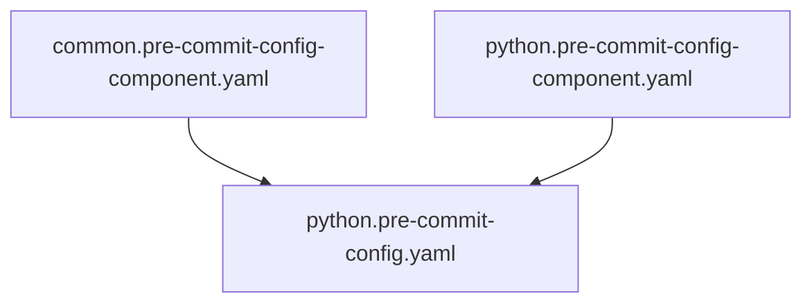

# Pre-commit configs

Pre-commits are assembled from components, under `/components`. Main config files can be compiled
from multiple components. Example for python:

The generate.sh script is used to autogenerate the files. This runs during pre-commit, and automatically adds generated files to the commit.

TODO: Create a GitHub bot user that automatically replaces the autogenerated section in consuming repositories.
